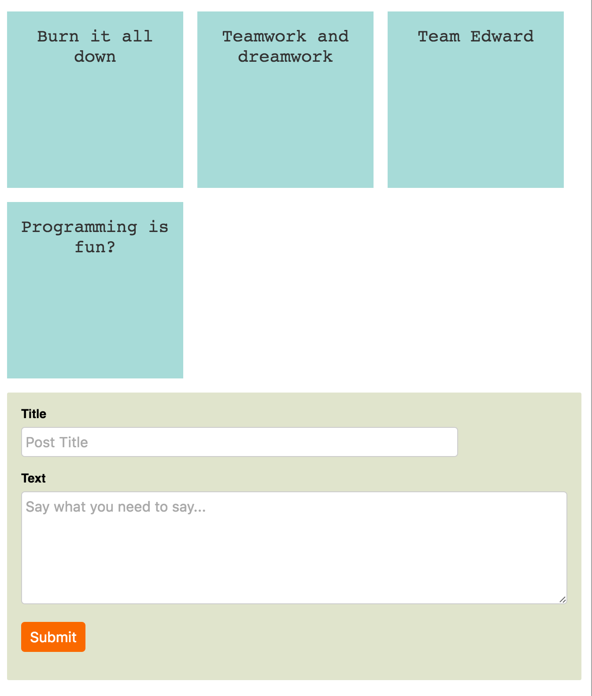
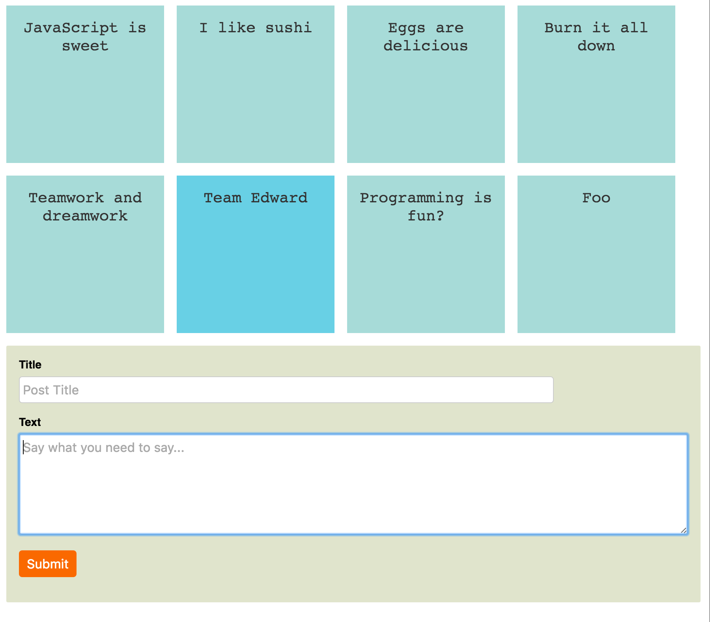

## Editor Pair Programming Exercise

Setup:

```sh
npm install
```

To run tests, run `npm test`.

Changes will happen in the `editor.js` file. You can review the tests in `test/editor.test.js`. Remove the `x` from `xit()` when you are ready to move on to the next test.


## App Pair Programming Exercise

Setup:

```sh
npm install
cd app
npm install
./bootstrap.sh
nodemon
# open browser to http://localhost:3000/
```

To run tests, run `npm test`

### #1 Feature: Make the "New Post" form work


### #2 Show tag counts

> Here at Troll inc we're in an API freeze.  That is, we can't change any server-side code anymore.  But the design team wants a comma-separated list of tag names to show up next to posts.  The only API we have for this is /api/v1/taggings and you cannot change any server-side code.

If the post has tags, then its: "Some title (tag1, tag2)"

If the post does not have tags, no parenthesis.

### #3 Alter the Posts table (string to text)

> So, your app has been in production for a little while, and some user reports have come in that sometimes their posts don't save.  The users pasted the text that doesn't work.

Then grab any text (hplipsum etc...) that's more than 255 characters and make it blow up.


### Optional: Make the app look like the designs

What it's testing:

- Basic box model things
- The ability to match borders, padding, margin, colors etc.. all from the designs (how to they determine colors?  widths?)

Narrow styles:



Wider styles:



